 
# JBNU General Student Council 
### An official mobile application of Jeonbuk National University Student Council. The fastest way to access campus notices and welfare. 
ⓒ 2022-2024. Changjin Ha. All Rights Reserved.  

## 🚀 Tech Stack

### Client (iOS)
- **Framework:** SwiftUI (Declarative UI / iOS 15.0+)
- **Architecture:** Feature-based Modular Structure (Home, Notice, Sports, Rent, etc.)
- **Maps:** Naver Maps SDK for Campus POI (Points of Interest)

### Backend (BaaS & Serverless)
- **Firebase Auth:** Authentication
- **Firebase Firestore:** Real-time data sync for rental items & petitions, notifications, associate stores
- **Firebase Functions:** Serverless business logic for sports matching & push triggers
- **Firebase Messaging (FCM):** Push notifications for council notices
- **Firebase Storage:** Handling image uploads for petitions and notices

## 🏗️ Architecture

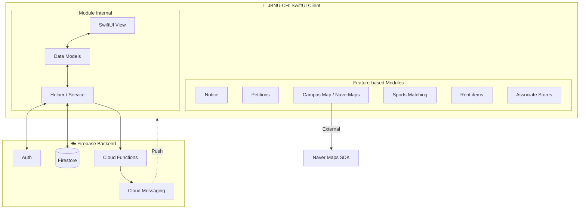

## 🧱 If I were to rebuild it in 2026

| Layer | Original | 2026 Pick | Reason |
|---|---|---|---|
| Package manager | CocoaPods | Swift Package Manager | Removes Ruby dep, faster CI, native Xcode integration |
| Firebase SDK | 6.34.0 | 11.x via SPM | Unblocks security patches, async/await APIs, smaller binary |
| ML features | `Firebase/MLVision` 0.21.0 | `GoogleMLKit` standalone | Direct successor, Firebase-version-independent |
| Async model | Completion handlers | `async/await` + `AsyncStream` | Cleaner code, native Swift Concurrency error handling |
| State | `ObservableObject` + `@Published` | `@Observable` (iOS 17+) or backport | Eliminates boilerplate, finer-grained invalidation |
| Navigation | `NavigationView` | `NavigationStack` | Programmatic routing, deep-linking, state restoration |
| Image loading | `SDWebImageSwiftUI` | Native `AyncImage` + `URLSession` cache | Zero dep, iOS 15+ is already required |
| JSON parsing | `SwiftyJSON` | `Codable` + `FirebaseFirestoreSwift` | Already in Podfile, type-safe, no extra dep |
| HTTP Client | Alamofire | `URLSession` async/await | Simpler for typical REST calls |
| Maps | `NMapsMap` 3.16.0 | `NMapsMap` (SPM) + latest | Same SDK, just via SPM |

## ✨ Core Features 

Show Contents

#### Home 
> Check out the features you use often and the latest news on one screen. 

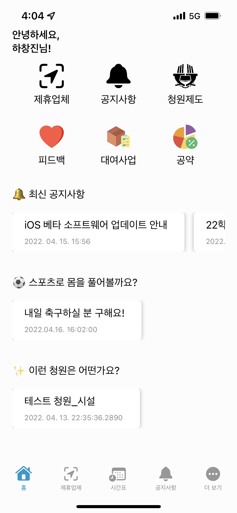 

#### Associate Stores 
> List of affiliates, location, benefits, representative menus, and everything from one touch to the phone. 

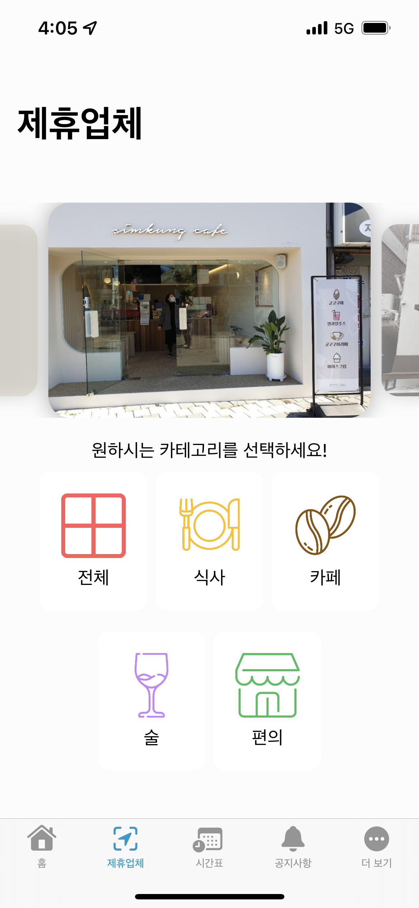
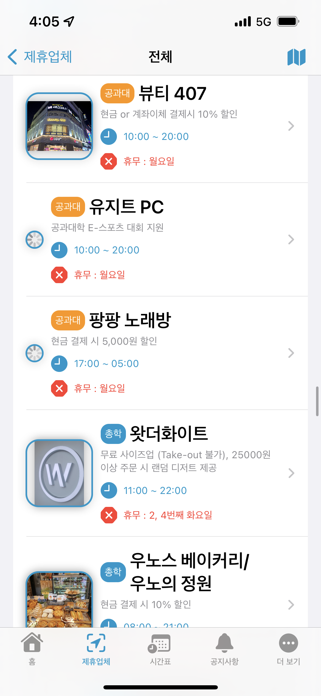

 

#### Notice 
> The quickest way to check student council announcements 

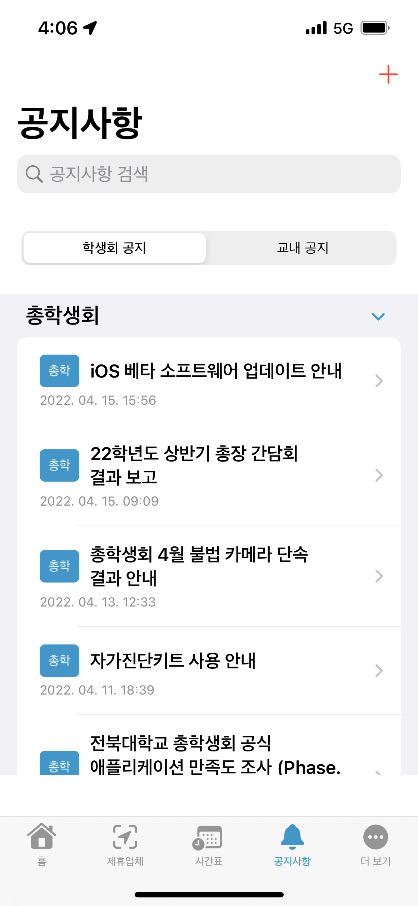
 

#### JBNU Petitions 
> Revised school regulations that Shape university regulations with your own hands. 

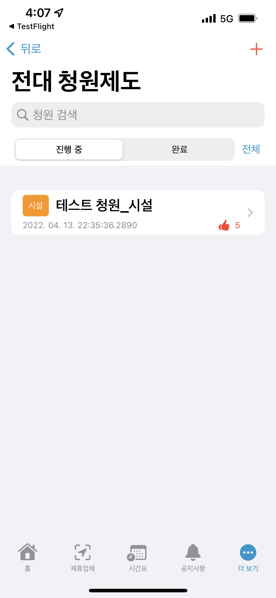
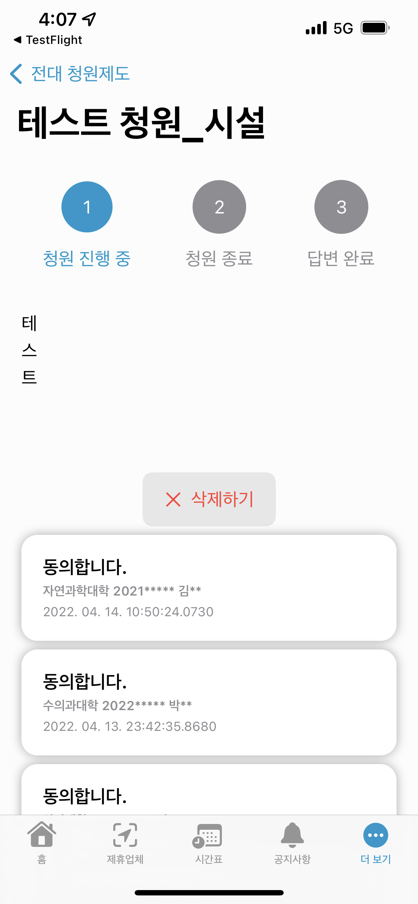 

#### Remaining quantity of rental items 
> Even if you don't come to the student council room, check the items and rental records at a glance in real time 

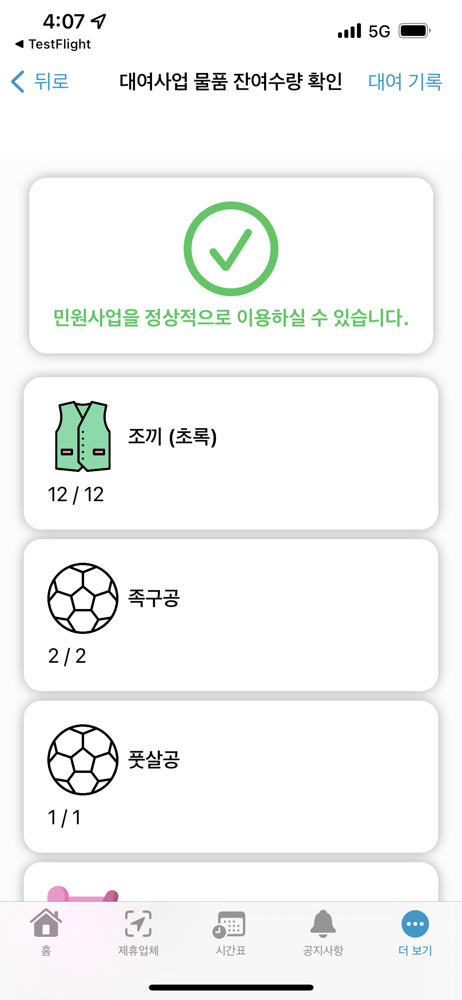
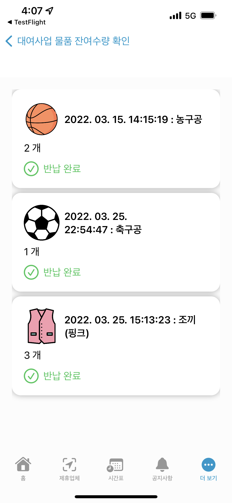 

#### Campus Map 
> Never get lost on campus again. 

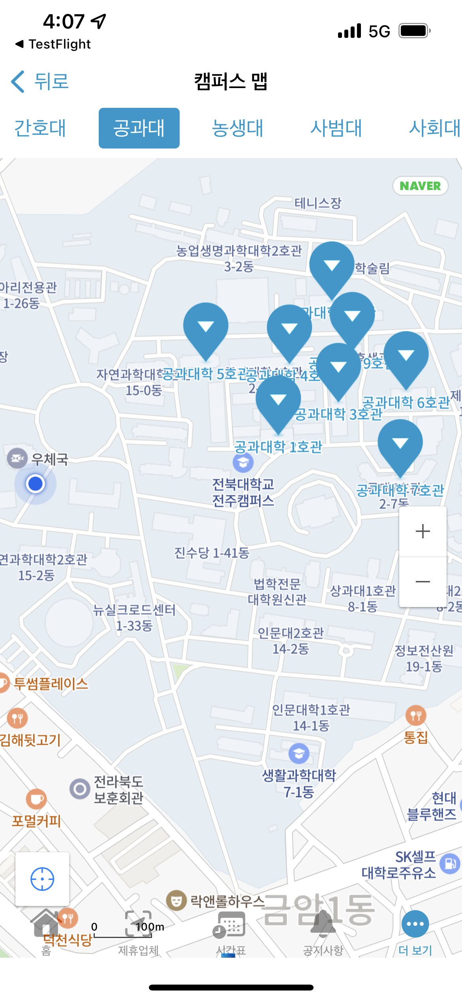 

#### Sports mercenary system 
> Looking for someone to work out with anytime, anywhere 

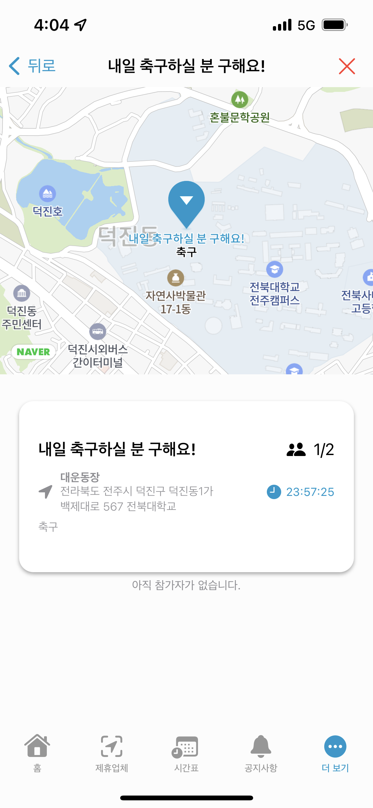 

#### HandWriting 
> A peek at the successful candidate's secret 

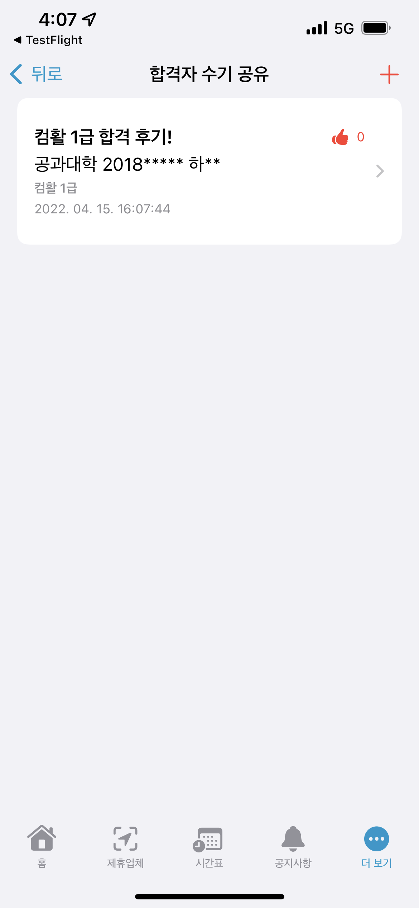 

#### Real-time pledge fulfillment rate 
> Student council's promise fulfillment rate in real time 

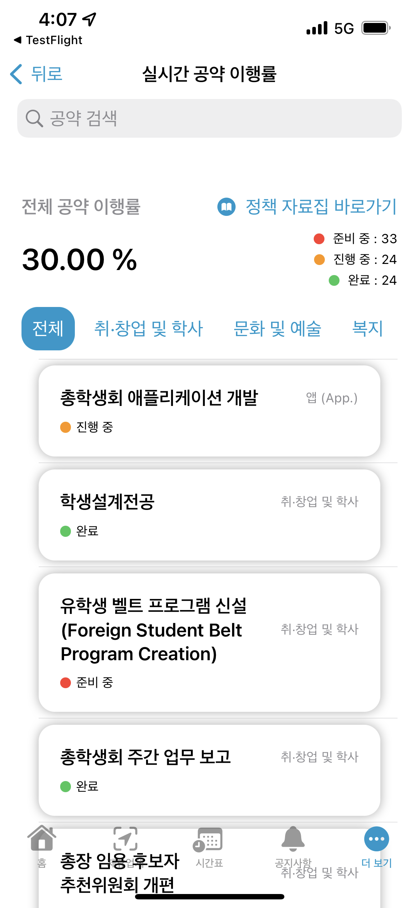 

#### Feedback Hub 
> From school facilities to apps, now make it with your ideas 

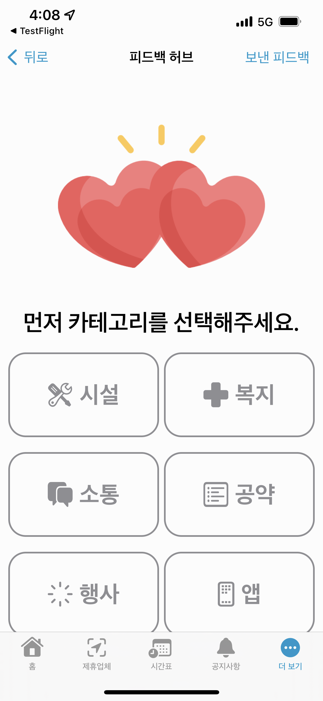 

## Compatibility 
> JBNU-CH is compatible with these devices.  
### iPhone 

> iPhone 15 Pro Max  
 iPhone 15 Pro  
 iPhone 15 Plus  
 iPhone 15  
 iPhone 14 Pro Max  
 iPhone 14 Pro  
 iPhone 14 Plus  
 iPhone 14  
 iPhone SE (3rd-Generation)  
 iPhone 13 Pro Max  
 iPhone 13 Pro  
 iPhone 13  
 iPhone 13 mini  
 iPhone 12 Pro Max  
 iPhone 12 Pro  
 iPhone 12  
 iPhone 12 mini  
 iPhone SE (2nd-Generation)  
 iPhone 11 Pro Max  
 iPhone 11 Pro  
 iPhone 11  
 iPhone Xs Max  
 iPhone Xs  
 iPhone XR  
 iPhone X  
 iPhone 8 Plus  
 iPhone 8  
 iPhone 7 Plus  
 iPhone 7  
 iPhone SE  
 iPhone 6s Plus  
 iPhone 6s  

### iPad 

> iPad Pro 12.9 (6th-Generation)  
 iPad Pro 11 (4th-Generation)  
 iPad Pro 12.9 (5th-Generation)  
 iPad Pro 11 (3rd-Generation)  
 iPad Pro 12.9 (4th-Generation)  
 iPad Pro 11 (2nd-Generation)  
 iPad Pro 12.9 (3rd-Generation)  
 iPad Pro 11  
 iPad Pro 12.9 (2nd-Generation)  
 iPad Pro 10.5  
 iPad Pro 12.9 (1st-Generation)  
 iPad Pro 9.7  
 iPad Air (5th-Generation)  
 iPad Air (4th-Generation)  
 iPad Air (3rd-Generation)  
 iPad Air 2  
 iPad mini (6th-Generation)  
 iPad mini (5th-Generation)  
 iPad mini 4  
 iPad (10th-Generation)  
 iPad (9th-Generation)  
 iPad (8th-Generation)  
 iPad (7th-Generation)  
 iPad (6th-Generation)  
 iPad (5th-Generation)  

 * Required iOS/iPadOS 15 or up.  
 * 500MB or higher storage required for install application.

